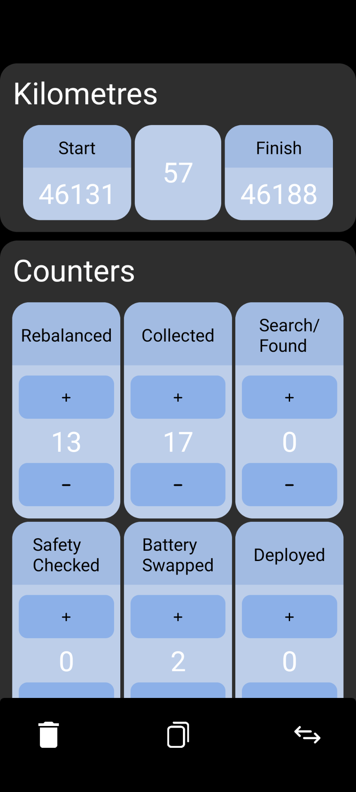

# Helper App

React Native counter app for counting in my current job

## Table of contents

- [General Info](#general-info)
- [Technologies Used](#technologies-used)
- [Features](#features)
- [Screenshots](#screenshots)
- [Setup](#setup)
- [Project Status](#project-status)
- [Room for Improvement](#room-for-improvement)
- [To do](#to-do)
- [Contact](#contact)

## General Info

This project was created to help me manage my current job. It allows me to keep a track of tasks complete. It gave me experience with React Native and developing for mobile first

## Technologies Used

Project is created with:

- React 17.0
- React Native 0.64
- Expo 44.0

## Features

- Counter app for keeping track of completed tasks
- Copy infomation to clipboard

## Screenshots



## Setup

main channel has 'working' version
dev channel has more up to date code and features. However code may be incomplete, or not run at all.

This project requires expo and a mobile device. Alternatively you can use an emulator.
To run this project, install it locally using npm:

```
$ cd ../countingproject
$ npm install
$ expo start
```

## Project Status

Project is: _in progress_

## Room for Improvement

- Counters can't be created and deleted in app
- Modularity could be improved
- default animations are a bit slow

#### To Do:

- Change state management to allow counters to be created in app
- refactor

## Contact

Created by me - feel free to contact me!
